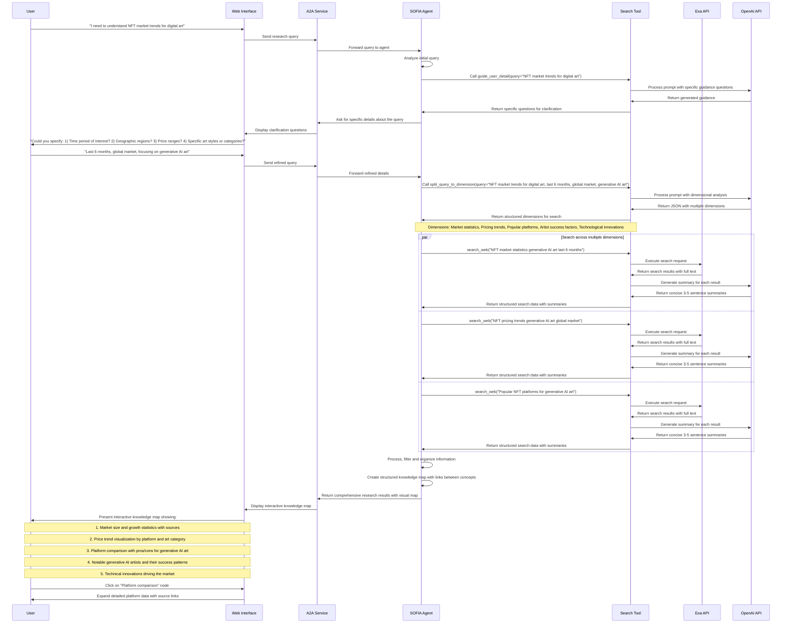
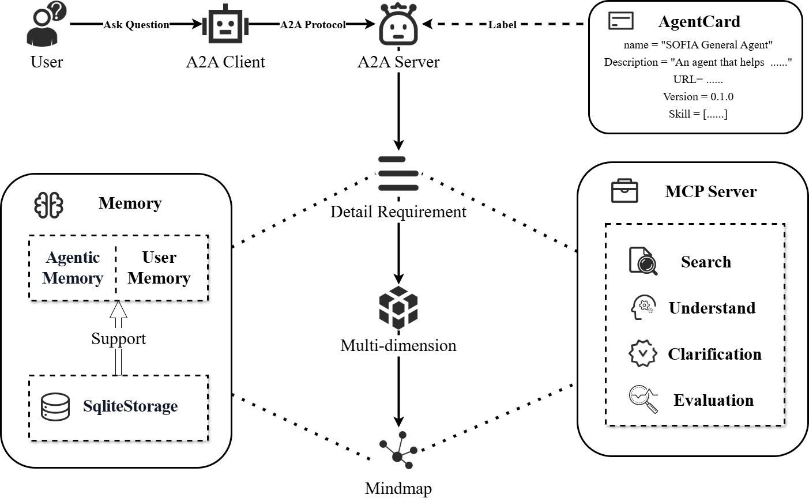

# S.O.F.I.A. Introduction

## Description
S.O.F.I.A. (Search-Oriented Functional Intelligence Agent) is an advanced AI-powered agent framework designed to transform how users research, learn, and organize information. By integrating sophisticated AI technologies with search capabilities, S.O.F.I.A. turns scattered content into visual knowledge maps that make complex information more accessible and understandable. The system is built on a modular architecture that ensures extensibility and maintainability, making it adaptable to various use cases and requirements.

## Problem Statement
In the age of information overload, people face three core challenges:
- **Information is overwhelming, and filtering it is costly.**
- Authoritative content is scattered across dozens of platforms, often redundant and noisy. Users must spend excessive time filtering, de-duplicating, and comparing — making it difficult to catch critical updates in time.**There’s no structure, making understanding hard to build.**
- Users don’t just want to “consume information” — they want to construct a clear knowledge framework. But existing platforms (like news feeds, Google Scholar, X, or AI tools) only deliver raw content, without helping users connect ideas, compare sources, or understand in context. Mental load is high, and cross-platform jumping leads to missed connections.**Traditional tools don’t know what you really care about.**

Whether it’s Google Scholar, a news app, or ChatGPT — most tools only react to direct questions. They don’t understand your broader goals, can’t anticipate what matters next, and don’t proactively recommend, filter, or remind you of what’s important.

## Key Features:
1. **InsightFlow – Your Visual Knowledge Stream**:
No more endless AI paragraphs.
With InsightFlow, every question and response becomes a mind map node — complete with:
   a. Topic tags
   b. A one-line AI summary
   c. Expandable key insight cards
   d. Visual paths that connect related ideas
*From “just answers” to structured understanding.*

2. **ThreadView – Topic-Based Question Tracking**:
Unlike ChatGPT’s long, linear scroll of mixed topics, Sofia organizes follow-up questions by topic.
   a. Each node has its own contextual Q&A sidebar
   b. Related follow-ups stay grouped — easy to review, revisit, or continue
   c. No more manual copy-paste into docs
   d. No more forgetting what you asked
*Your questions stay connected — and your thought process stays intact.*

3. **AutoRadar – Real-Time Update Detection**
Follow a topic node, and Sofia becomes your intelligent update scanner.
   a. Tracks real-time updates from trusted sources (arXiv, Twitter, GitHub, news...)
   b. Adds new, relevant insights to your map as new breakthroughs emerge
   c. Notifies you when something matches your interest — before you ask
*Like a second brain — tuned to what you care about.*

4. **Search and Information Retrieval**:
   a. **Google Search Integration**: Performs web searches based on user queries using SerpApi.
   b. **Structured Results**: Extracts structured information like titles, links, and summaries from search results.

5. **Content Analysis**:
   a. **Article Quality Assessment**: Evaluates content quality across 12 different dimensions.
   b. **Text Coherence Analysis**: Analyzes text for coherence, argument completeness, and language quality.
   c. **Content Depth Evaluation**: Assesses information density, analysis depth, and reasoning quality.

6. **Technical Capabilities**:
   a. **Agent Communication**: Uses A2A (Agent-to-Agent) protocol for seamless agent communication.
   b. **Tool Integration**: Implements MCP (Model Context Protocol) for tool management.

## Use Cases:
1.📝 **Student Building a Research Framework**:
**Problem:** Constantly switching between articles, ChatGPT, and notes to build a topic outline — overwhelmed and scattered.
**How Sofia Helps:**
   - Automatically organizes questions and AI answers into visual topic maps
   - Summarizes key insights per topic node
   - Allows students to build a clear, structured knowledge framework over time
*“Now I can see my thinking evolve — no more copy-pasting from 10 tabs.”*

2.🧑‍🔬 **AI Researcher Tracking Breakthroughs**:
**Problem:** Missed a relevant paper that could have saved a month of work — too many updates across too many platforms.
**How Sofia Helps:**
   - AutoRadar tracks new releases from arXiv, Twitter, GitHub, and top labs
   - Adds relevant updates directly into the mind map
   - Sends alerts when something aligns with their current project
*"Sofia caught a new method that was exactly what I was stuck on."*

3.📊 **Financial Analyst Building a Macro Framework**:
**Problem:** Needs to understand how different events (PPI, interest rate decisions, geopolitical shifts) affect currency markets — but information is scattered and fast-moving.
**How Sofia Helps:**
   - InsightFlow visually links economic events to market drivers
   - AutoRadar pushes structured updates as macro data drops
   - Analyst can build a dynamic, evolving understanding
*“I finally have a visual model of how the macro pieces connect — and I get updates without refreshing 10 sites.”*

4. 💼 **Startup Operator Trying to Stay Sharp**:
**Problem:** Wants to keep up with AI trends, product strategy ideas, and founder best practices — but overwhelmed by newsletters, social feeds, and long-form podcasts.
**How Sofia Helps:**
   - Curates relevant insights from multiple sources
   - Structures them into topic-based cards for daily review
   - Allows bookmarking and tagging for personal knowledge building
*“Now I don’t just consume information — I retain and organize it.”*

## Technical Architecture:
- **Agent Service**: Core component using Agno for agent orchestration.
- **MCP Tool Services**: Specialized tools including Search Tool.
- **A2A Protocol Implementation**: Enables seamless communication between agents.
- **Multiple User Interfaces**: CLI for quick testing and development, Web interface for rich graphical interaction.

## Workflow Diagram:

## Algorithm Architecture:

