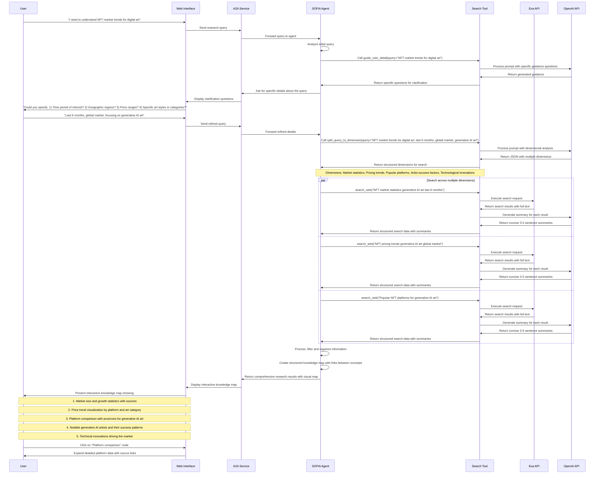

# S.O.F.I.A. Introduction

## Description
S.O.F.I.A. (Search-Oriented Functional Intelligence Agent) is an advanced AI-powered agent framework designed to transform how users research, learn, and organize information. By integrating sophisticated AI technologies with search capabilities, S.O.F.I.A. turns scattered content into visual knowledge maps that make complex information more accessible and understandable. The system is built on a modular architecture that ensures extensibility and maintainability, making it adaptable to various use cases and requirements.

## Key Features:
1. **Smart Information Processing**:
   a. **Visual Knowledge Maps**: Transforms complex information into interactive knowledge maps instead of endless text.
   b. **Organized Conversations**: Each topic gets its own thread, eliminating the need to scroll through mixed conversations.
   c. **Automatic Updates**: Tracks topics of interest and adds new information to maps automatically.

2. **Search and Information Retrieval**:
   a. **Google Search Integration**: Performs web searches based on user queries using SerpApi.
   b. **Structured Results**: Extracts structured information like titles, links, and summaries from search results.

3. **Content Analysis**:
   a. **Article Quality Assessment**: Evaluates content quality across 12 different dimensions.
   b. **Text Coherence Analysis**: Analyzes text for coherence, argument completeness, and language quality.
   c. **Content Depth Evaluation**: Assesses information density, analysis depth, and reasoning quality.

4. **Technical Capabilities**:
   a. **Agent Communication**: Uses A2A (Agent-to-Agent) protocol for seamless agent communication.
   b. **Tool Integration**: Implements MCP (Model Context Protocol) for tool management.

5. **Flexibility and Adaptability**:
   a. **Multiple Interfaces**: Offers both CLI and Web interfaces for different user preferences.
   b. **Modular Design**: Features independent components that can be extended or modified.
   c. **Configurable Parameters**: Allows customization of search parameters, model selection, and more.

## Use Cases:
1. **Research and Learning**:
   a. **Example**: A researcher organizing findings from multiple sources into coherent knowledge maps.

2. **Information Organization**:
   a. **Example**: A student creating visual maps of interconnected concepts and ideas.

3. **Content Evaluation**:
   a. **Example**: An editor assessing article quality across multiple dimensions before publication.

4. **Data-Driven Decision Making**:
   a. **Example**: A business professional gathering and organizing information to make informed decisions.

## Technical Architecture:
- **Agent Service**: Core component using Agno for agent orchestration.
- **MCP Tool Services**: Specialized tools including Search Tool.
- **A2A Protocol Implementation**: Enables seamless communication between agents.
- **Multiple User Interfaces**: CLI for quick testing and development, Web interface for rich graphical interaction.

## Workflow Diagram:
