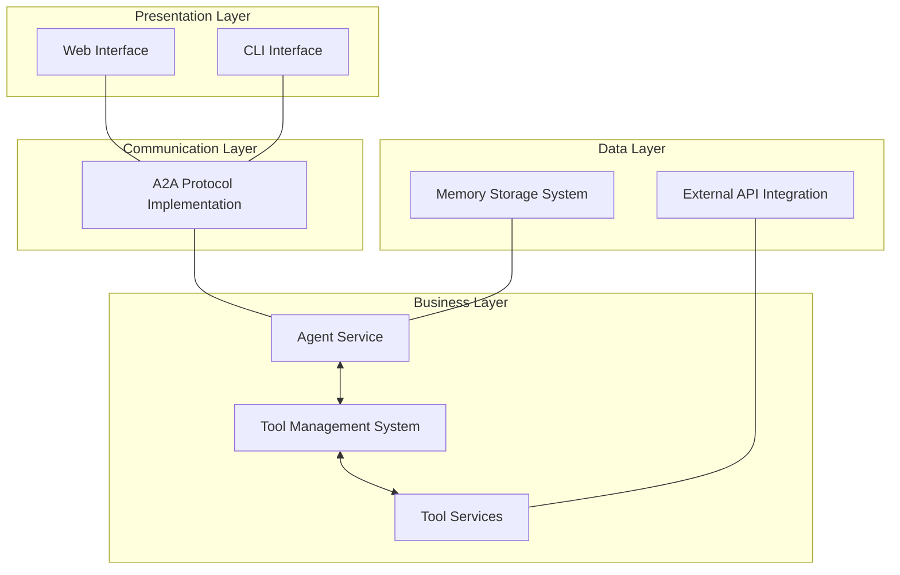
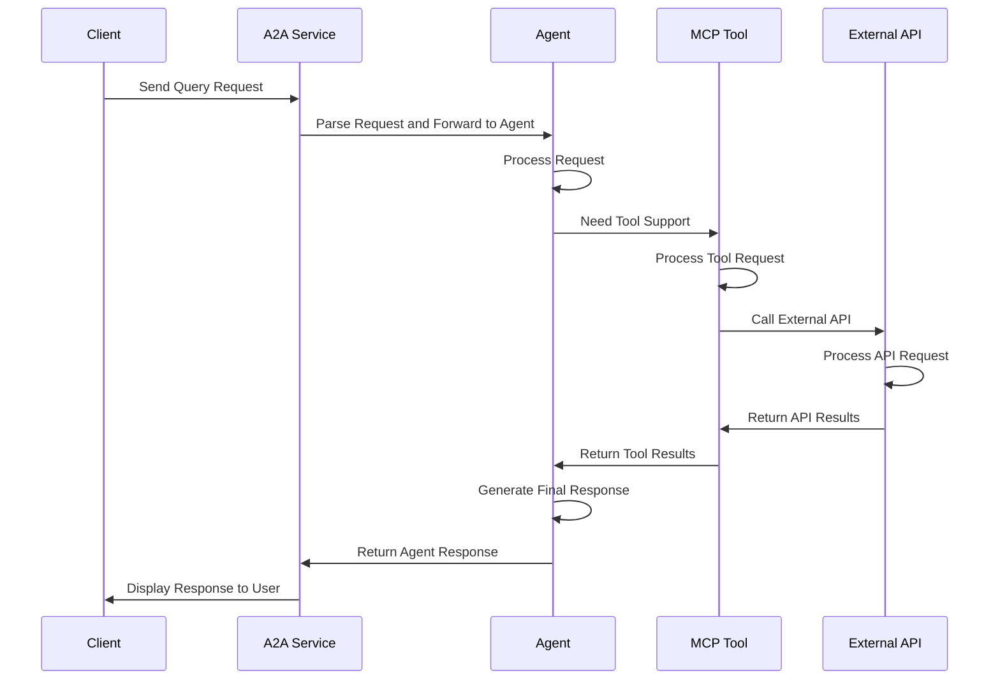

# S.O.F.I.A. Technical Solution Document

## Table of Contents

- [S.O.F.I.A. Technical Solution Document](#sofia-technical-solution-document)
  - [Table of Contents](#table-of-contents)
  - [Project Overview](#project-overview)
  - [System Architecture](#system-architecture)
    - [Overall Architecture](#overall-architecture)
    - [Layered Architecture Diagram](#layered-architecture-diagram)
    - [Swimlane Diagram](#swimlane-diagram)
  - [Key Protocols](#key-protocols)
    - [A2A Protocol](#a2a-protocol)
    - [MCP Protocol](#mcp-protocol)
  - [Core Components](#core-components)
    - [Agent Service](#agent-service)
    - [MCP Tool Services](#mcp-tool-services)
    - [User Interface](#user-interface)
  - [Data Flow](#data-flow)
  - [Technology Stack](#technology-stack)
  - [Extensibility and Maintainability](#extensibility-and-maintainability)
  - [Security Considerations](#security-considerations)
  - [Deployment Plan](#deployment-plan)

## Project Overview

S.O.F.I.A. (Search-Oriented Functional Intelligence Agent) is a modular, search-centric AI agent framework designed to integrate structured information flow and intelligent decision-making. The system is built on the following key technologies:

- **Agno**: For agent workflow orchestration
- **Model Context Protocol (MCP)**: For tool management
- **Agent2Agent Protocol (A2A)**: For agent communication and interoperability

The system provides various functionalities, including but not limited to:

- Google search functionality based on SerpApi
- Arithmetic calculation capabilities
- Article quality assessment
- Personalized user memory management

## System Architecture

### Overall Architecture

S.O.F.I.A. is designed with a microservices architecture, consisting of the following main components:

```mermaid
graph TD
    Client[Client<br/>(Web/CLI)] <--> AgentService[Agent Service]
    AgentService <--> MCPToolServices[MCP Tool Services]
    AgentService <--> MemoryStorage[Memory Storage]
    MCPToolServices <--> ExternalAPIs[External APIs<br/>(OpenAI/SerpApi)]
```

### Layered Architecture Diagram

S.O.F.I.A. system adopts a clear layered architecture, ensuring separation of concerns and maintainability:



### Swimlane Diagram

Below is a swimlane diagram of the user request processing flow, showing the interactions between system components:



## Key Protocols

### A2A Protocol

A2A (Agent-to-Agent) is an open standard protocol developed by Google that supports seamless communication between AI agents built on different frameworks and by different vendors. This protocol has the following main features:

- **Agent Discovery**: Agents can discover each other's capabilities and endpoints
- **Task Management**: Unified approach to initiating, tracking, and completing tasks
- **Streaming Support**: Real-time communication through Server-Sent Events (SSE)
- **Structured Messaging**: Support for text, files, and structured data exchanges
- **Push Notifications**: Asynchronous updates through webhook mechanisms

The A2A protocol implementation in Sofia system mainly includes the following components:

- `AgentCard`: Describes agent metadata, including name, description, URL, and skills
- `AgentSkill`: Defines agent capabilities
- `Message`: Messages exchanged between agents
- `Task`: Task representation, including status and history
- `TaskStatus`: Task status representation

### MCP Protocol

MCP (Model Context Protocol) is a protocol for managing and integrating external tools, enabling Large Language Models (LLMs) to access and control external functionality. The Sofia system uses the MCP protocol to implement the following features:

- **Tool Definition**: Define tool interfaces in a standardized way
- **Tool Invocation**: Enable Agents to call external tools
- **Result Processing**: Process tool call results and integrate them into the conversation flow

In Sofia, MCP tool services include:

- **Arithmetic Tool**: Perform basic mathematical operations
- **Search Tool**: Perform web searches and retrieve information

## Core Components

### Agent Service

Agent Service is the core component of the S.O.F.I.A. system, responsible for processing user requests, coordinating tool calls, and generating responses. It has the following main functionalities:

- Process user queries
- Manage user memories
- Coordinate MCP tool calls
- Generate responses to user queries

The Agent Service is built on Agno, using LLMs (typically OpenAI's GPT models) to understand queries, execute tool calls, and synthesize responses.

### MCP Tool Services

MCP tool services provide specific functionality to the agent, enabling it to perform specific tasks. S.O.F.I.A. currently includes the following MCP tool services:

1. **Arithmetic Tool**:

   - Supports basic arithmetic operations (addition, subtraction, multiplication, division)
   - Can extract operation types and numbers from natural language descriptions
2. **Search Tool**:

   - Uses SerpApi for Google searches
   - Supports knowledge graph information extraction
   - Provides structured search results
   - Can guide users to provide more detailed queries

### User Interface

S.O.F.I.A. provides two types of user interfaces:

1. **CLI Interface**:

   - Command-line interaction interface
   - For quick testing and development
2. **Web Interface**:

   - Built with Next.js
   - Provides a graphical user interface
   - Supports rich text interaction
   - Responsive design, adapting to different devices

## Data Flow

The data flow in the S.O.F.I.A. system is as follows:

1. **User Input**: Receive user queries from CLI or Web interface
2. **A2A Processing**: Forward queries to the agent service through the A2A protocol
3. **Agent Processing**:
   - Agent analyzes the query
   - Decides if tool support is needed
   - If needed, calls the appropriate MCP tool
   - Integrates tool results
   - Generates final response
4. **MCP Tool Call**:
   - Receives tool call requests from the agent
   - Executes specific tasks
   - Returns results to the agent
5. **Memory Storage**:
   - Stores user memories
   - Retrieves relevant memories when needed
6. **Response Return**: Returns the response to the user interface through the A2A protocol

## Technology Stack

The main technology stack used by the S.O.F.I.A. system includes:

**Backend**:

- Python
- Agno: Agent workflow orchestration
- FastMCP: MCP tool implementation
- SQLite: Memory storage
- OpenAI API: LLM integration
- SerpApi/Exa: Search service integration

**Frontend**:

- Next.js
- React
- TypeScript
- Tailwind CSS

**Communication**:

- A2A protocol: Agent communication
- MCP protocol: Tool integration
- Server-Sent Events (SSE): Real-time communication

## Extensibility and Maintainability

S.O.F.I.A.'s design considers extensibility and maintainability:

1. **Modular Design**:

   - Independent service components
   - Clear interface definitions
   - Loose coupling architecture
2. **Standard Protocols**:

   - Use of standard protocols like A2A and MCP
   - Easy to integrate new components
3. **Pluggable Tools**:

   - New tools can be added as MCP services
   - No need to modify core agent logic
4. **Unified Configuration Management**:

   - Environment variable configuration
   - Centralized configuration files

## Security Considerations

Security considerations for the S.O.F.I.A. system include:

1. **API Key Management**:

   - All API keys are stored in environment variables
   - Avoid hardcoding sensitive information
2. **Validation and Authorization**:

   - API request validation
   - Service-to-service authorization mechanisms
3. **Data Privacy**:

   - Secure user memory storage
   - Minimum necessary information principle
4. **Error Handling**:

   - Robust error capture and handling
   - Prevention of sensitive information leakage

## Deployment Plan

The S.O.F.I.A. system supports multiple deployment plans:

1. **Local Development**:

   - Using unified startup script
   - Support for debug mode
2. **Containerized Deployment**:

   - Using Docker and Docker Compose
   - Service isolation and orchestration
3. **Cloud Deployment**:

   - Can be deployed to various cloud platforms
   - Support for horizontal scaling
